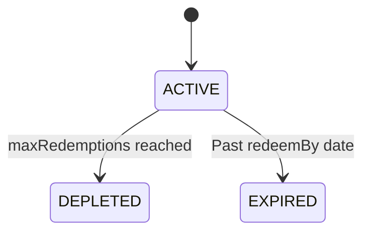

## Schema

| Field | Type | Description |
|-------|------|-------------|
| `couponId` | UUIDv7 | Unique identifier |
| `externalRef` | string | Stripe coupon (unique) |
| `code` | string | Unique code, max 40 |
| `name` | string | Display name, max 255 |
| `type` | enum | `FIXED` (cents), `PERCENTAGE` |
| `amount` | integer | Discount amount |
| `currency` | enum | Currency |
| `duration` | enum | `ONCE`, `REPEATING` |
| `durationInMonths` | integer? | For REPEATING |
| `maxRedemptions` | integer? | Max uses |
| `redeemBy` | datetime? | Expiration date |
| `timesRedeemed` | integer | Usage count |
| `amountRedeemed` | integer | Total discount given |
| `status` | enum | `ACTIVE`, `DEPLETED`, `EXPIRED` |
| `createdBy` | UUIDv7 | Creator |
| `createdAt` | datetime | Creation |
| `updatedBy` | UUIDv7 | Last updater |
| `updatedAt` | datetime | Last update |
| `deletedBy` | UUIDv7? | Deleter |
| `deletedAt` | datetime? | Soft delete |

## Status Transitions

## Relationships

- **Has many** CouponUsages
- **Has many** SubscriptionCoupons

## Business Rules

- `code` globally unique
- FIXED = absolute discount in cents; PERCENTAGE = percent value
- ONCE = applies to single invoice per org; REPEATING = per billing cycle
- Synced with Stripe
