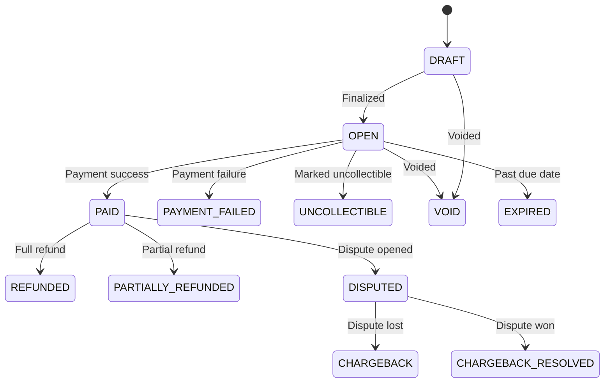

## Schema

| Field | Type | Description |
|-------|------|-------------|
| `invoiceId` | UUIDv7 | Unique identifier |
| `organizationId` | UUIDv7 | FK to Organization |
| `subscriptionId` | UUIDv7? | FK to Subscription |
| `externalRef` | string | Stripe invoice ID (unique) |
| `type` | enum | `PLAN`, `FEE` |
| `paymentMethod` | enum? | `CARD`, `BOLETO` |
| `card` | JSON? | `{brand, last4, expMonth, expYear}` |
| `boleto` | JSON? | `{url}` |
| `currency` | enum | `USD`, `BRL`, `EUR` |
| `totalAmount` | integer | Total in cents |
| `discountAmount` | integer | Discount in cents |
| `payableAmount` | integer | Payable in cents |
| `discounts` | array | Applied discounts |
| `lines` | array | InvoiceLine items |
| `status` | enum | See below |
| `issuedAt` | datetime | Issue date |
| `dueDate` | datetime | Due date |
| `paidAt` | datetime? | Payment date |
| `createdAt` | datetime | Creation |
| `updatedAt` | datetime | Last update |

## Status Transitions

## Relationships

- **Belongs to** [Organization](/domain/data-modeling/iam/organization)
- **Belongs to** [Subscription](/domain/data-modeling/billing/subscription) (optional)
- **Has many** InvoiceLines
- **Has many** CouponUsages / VoucherUsages
- **Has one** InvoiceBillingThreshold (optional)

## Business Rules

- Synced with Stripe
- Can include coupon + voucher discounts
- Supports upsert by externalRef for manual invoices
