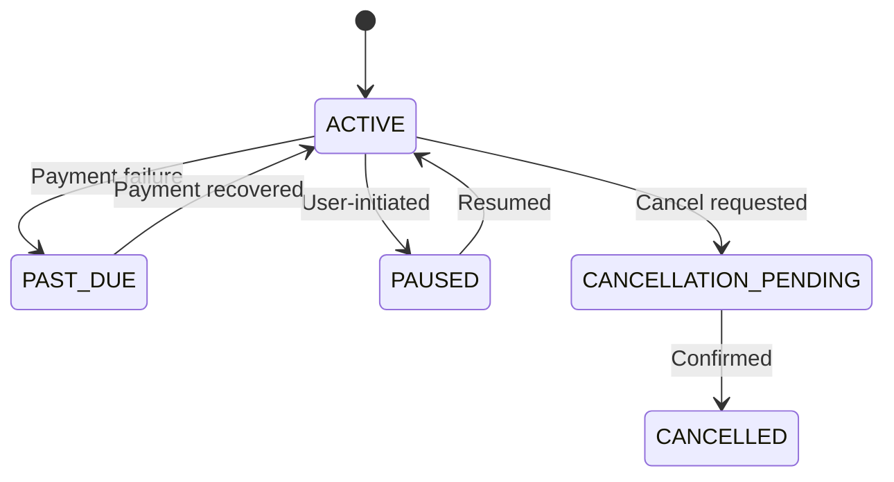

## Schema

| Field | Type | Description |
|-------|------|-------------|
| `subscriptionId` | UUIDv7 | Unique identifier |
| `organizationId` | UUIDv7 | FK to Organization |
| `planId` | UUIDv7 | FK to Plan |
| `planIntervalId` | UUIDv7 | FK to PlanInterval |
| `externalPlanRef` | string? | Stripe subscription (plan) |
| `externalFeeRef` | string? | Stripe subscription (fees) |
| `currency` | enum | `USD`, `BRL`, `EUR` |
| `status` | enum | See below |
| `pastDueReason` | enum? | `PLAN`, `FEE`, `PLAN_FEE` |
| `pastDueAt` | datetime? | When it became past due |
| `pausedBy` | UUIDv7? | Who paused |
| `pausedAt` | datetime? | When paused |
| `cancelledBy` | UUIDv7? | Who cancelled |
| `cancelledAt` | datetime? | When cancelled |
| `createdBy` | UUIDv7 | Creator |
| `createdAt` | datetime | Creation |
| `updatedBy` | UUIDv7 | Last updater |
| `updatedAt` | datetime | Last update |

## Status Transitions

## Relationships

- **Belongs to** [Organization](/domain/data-modeling/iam/organization)
- **Belongs to** Plan / PlanInterval
- **Has many** [Invoices](/domain/data-modeling/billing/invoice)
- **Has many** SubscriptionCoupons

## Business Rules

- Created with status `ACTIVE`
- `pastDueReason` indicates failed component
- Pause supports `collectionBehavior`: `KEEP_AS_DRAFT` or `MARK_UNCOLLECTIBLE`
- Supports coupon application via SubscriptionCoupon
