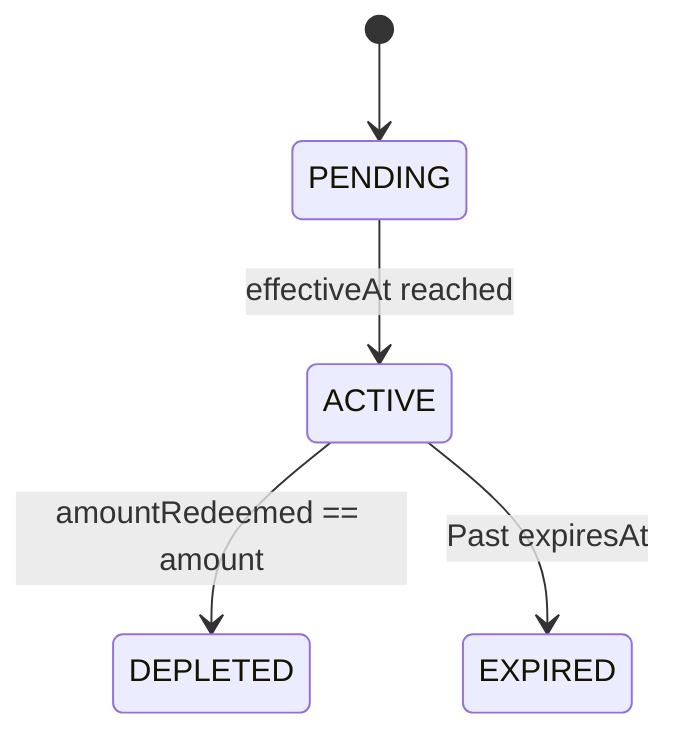

## Schema

| Field | Type | Description |
|-------|------|-------------|
| `voucherId` | UUIDv7 | Unique identifier |
| `organizationId` | UUIDv7 | FK to Organization |
| `externalRef` | string? | Stripe credit grant |
| `name` | string | Voucher name, max 255 |
| `amount` | integer | Credit in cents |
| `currency` | enum | `USD`, `BRL`, `EUR` |
| `effectiveAt` | datetime? | Activation date |
| `expiresAt` | datetime? | Expiration date |
| `amountRedeemed` | integer | Used amount in cents |
| `status` | enum | `PENDING`, `ACTIVE`, `DEPLETED`, `EXPIRED` |
| `createdBy` | UUIDv7 | Creator |
| `createdAt` | datetime | Creation |
| `updatedBy` | UUIDv7 | Last updater |
| `updatedAt` | datetime | Last update |
| `deletedBy` | UUIDv7? | Deleter |
| `deletedAt` | datetime? | Soft delete |

## Status Transitions

## Relationships

- **Belongs to** [Organization](/domain/data-modeling/iam/organization)
- **Has many** VoucherFees
- **Has many** VoucherUsages

## Business Rules

- Created via **Saga pattern** with Stripe billing credit grant
- Optional fee restrictions via VoucherFees
- Status managed by effectiveAt/expiresAt dates
