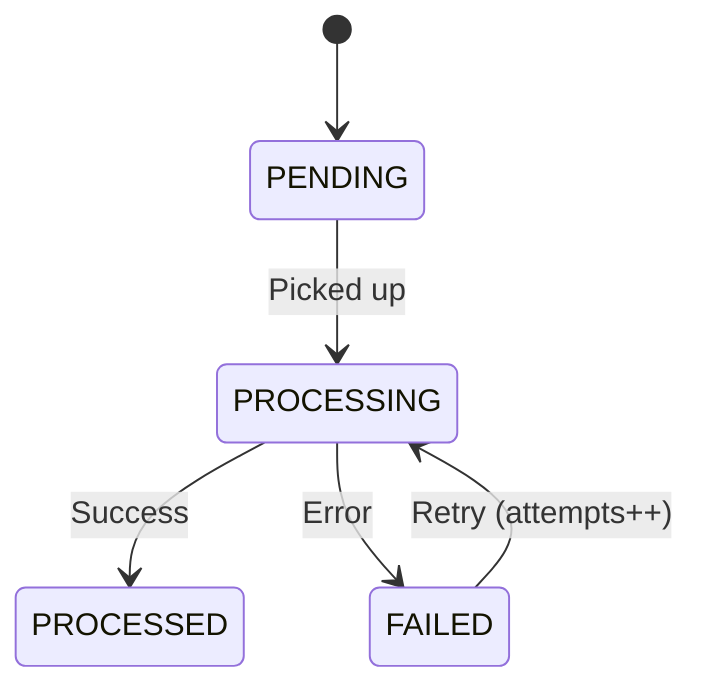

## Schema

| Field | Type | Description |
|-------|------|-------------|
| `webhookId` | UUIDv7 | Unique identifier |
| `externalRef` | string | Stripe event ID, max 400 |
| `provider` | enum | `STRIPE` |
| `eventType` | string | Stripe event type, max 255 |
| `headers` | JSON | Request headers |
| `body` | JSON | Request body |
| `signature` | string | HMAC signature |
| `status` | enum | `PENDING`, `PROCESSING`, `PROCESSED`, `FAILED` |
| `attempts` | integer | Processing attempts (default 0) |
| `errors` | JSON? | Error details |
| `receivedAt` | datetime | When received |
| `processedAt` | datetime? | When processed |
| `createdAt` | datetime | Creation |
| `updatedAt` | datetime | Last update |

## Status Transitions

## Business Rules

- Unique constraint: (provider, externalRef)
- HMAC signature validated on receipt
- Failed webhooks can retry (attempts incremented)
- Audit log only — no relationships
