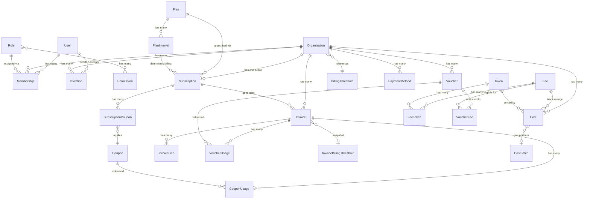
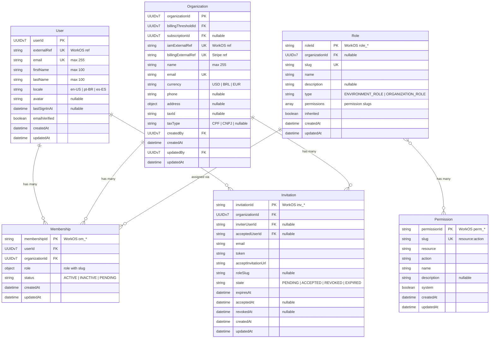
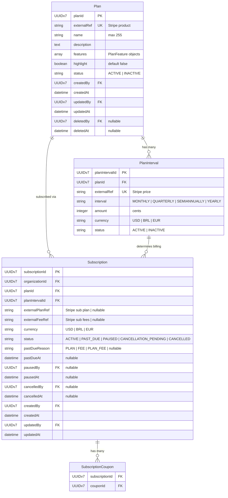
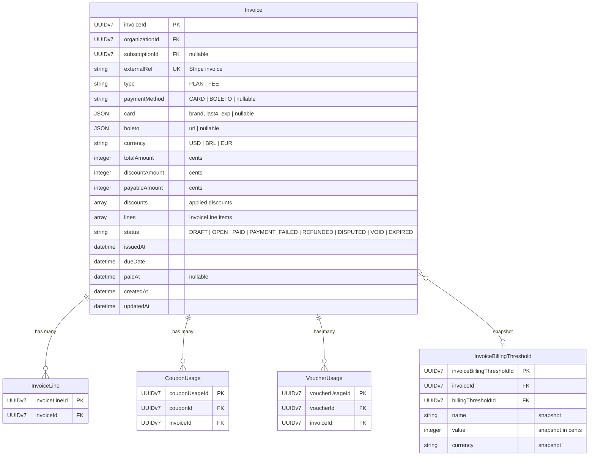
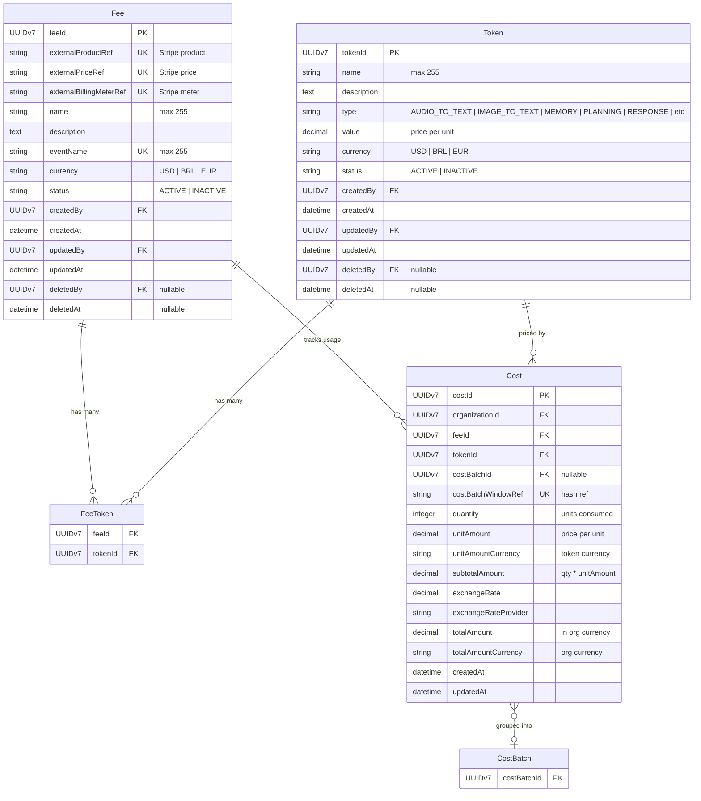
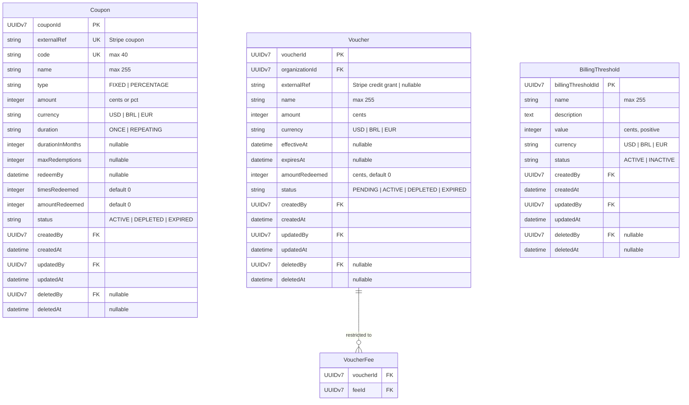
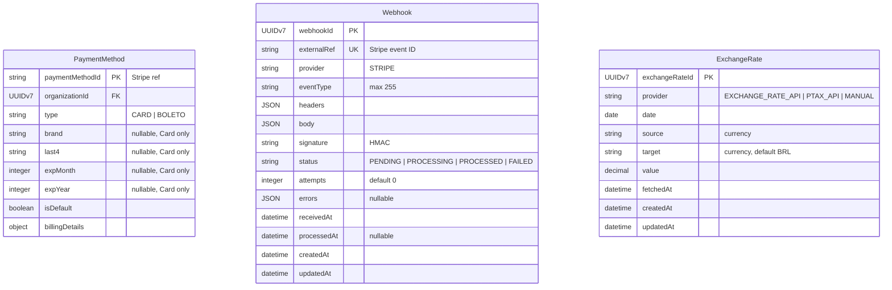

## Overview

```mermaid
erDiagram
    %% ── IAM ──

    User ||--o{ Membership : "has many"
    User ||--o{ Invitation : "sends / accepts"
    Organization ||--o{ Membership : "has many"
    Organization ||--o{ Invitation : "has many"
    Role ||--o{ Membership : "assigned via"
    Role }o--o{ Permission : "has many"

    %% ── IAM → Billing bridge ──

    Organization ||--o| Subscription : "has one active"
    Organization ||--o{ Invoice : "has many"
    Organization ||--o{ Cost : "has many"
    Organization ||--o{ Voucher : "has many"
    Organization }o--|| BillingThreshold : "references"
    Organization ||--o{ PaymentMethod : "has many"

    %% ── Billing core ──

    Plan ||--o{ PlanInterval : "has many"
    Plan ||--o{ Subscription : "subscribed via"
    PlanInterval ||--o{ Subscription : "determines billing"

    Subscription ||--o{ Invoice : "generates"
    Subscription ||--o{ SubscriptionCoupon : "has many"
    SubscriptionCoupon }o--|| Coupon : "applies"

    Invoice ||--o{ InvoiceLine : "has many"
    Invoice ||--o{ CouponUsage : "has many"
    Invoice ||--o{ VoucherUsage : "has many"
    Invoice }o--o| InvoiceBillingThreshold : "snapshot"

    %% ── Usage-based billing ──

    Fee ||--o{ Cost : "tracks usage"
    Token ||--o{ Cost : "priced by"
    Fee ||--o{ FeeToken : "has many"
    Token ||--o{ FeeToken : "has many"
    Cost }o--o| CostBatch : "grouped into"

    %% ── Credits & Discounts ──

    Coupon ||--o{ CouponUsage : "redeemed"
    Voucher ||--o{ VoucherUsage : "redeemed"
    Voucher ||--o{ VoucherFee : "restricted to"
    Fee ||--o{ VoucherFee : "eligible for"
```

## IAM

```mermaid
erDiagram
    User {
        UUIDv7 userId PK
        string externalRef UK "WorkOS ref"
        string email UK "max 255"
        string firstName "max 100"
        string lastName "max 100"
        string locale "en-US | pt-BR | es-ES"
        string avatar "nullable"
        datetime lastSignInAt "nullable"
        boolean emailVerified
        datetime createdAt
        datetime updatedAt
    }

    Organization {
        UUIDv7 organizationId PK
        UUIDv7 billingThresholdId FK
        UUIDv7 subscriptionId FK "nullable"
        string iamExternalRef UK "WorkOS ref"
        string billingExternalRef UK "Stripe ref"
        string name "max 255"
        string email UK
        string currency "USD | BRL | EUR"
        string phone "nullable"
        object address "nullable"
        string taxId "nullable"
        string taxType "CPF | CNPJ | nullable"
        UUIDv7 createdBy FK
        datetime createdAt
        UUIDv7 updatedBy FK
        datetime updatedAt
    }

    Membership {
        string membershipId PK "WorkOS om_*"
        UUIDv7 userId FK
        UUIDv7 organizationId FK
        object role "role with slug"
        string status "ACTIVE | INACTIVE | PENDING"
        datetime createdAt
        datetime updatedAt
    }

    Role {
        string roleId PK "WorkOS role_*"
        UUIDv7 organizationId FK "nullable"
        string slug UK
        string name
        string description "nullable"
        string type "ENVIRONMENT_ROLE | ORGANIZATION_ROLE"
        array permissions "permission slugs"
        boolean inherited
        datetime createdAt
        datetime updatedAt
    }

    Permission {
        string permissionId PK "WorkOS perm_*"
        string slug UK "resource:action"
        string resource
        string action
        string name
        string description "nullable"
        boolean system
        datetime createdAt
        datetime updatedAt
    }

    Invitation {
        string invitationId PK "WorkOS inv_*"
        UUIDv7 organizationId FK
        string inviterUserId FK "nullable"
        string acceptedUserId FK "nullable"
        string email
        string token
        string acceptInvitationUrl
        string roleSlug "nullable"
        string state "PENDING | ACCEPTED | REVOKED | EXPIRED"
        datetime expiresAt
        datetime acceptedAt "nullable"
        datetime revokedAt "nullable"
        datetime createdAt
        datetime updatedAt
    }

    User ||--o{ Membership : "has many"
    User ||--o{ Invitation : "sends / accepts"
    Organization ||--o{ Membership : "has many"
    Organization ||--o{ Invitation : "has many"
    Role ||--o{ Membership : "assigned via"
    Role }o--o{ Permission : "has many"
```

## Subscription & Plans

```mermaid
erDiagram
    Plan {
        UUIDv7 planId PK
        string externalRef UK "Stripe product"
        string name "max 255"
        text description
        array features "PlanFeature objects"
        boolean highlight "default false"
        string status "ACTIVE | INACTIVE"
        UUIDv7 createdBy FK
        datetime createdAt
        UUIDv7 updatedBy FK
        datetime updatedAt
        UUIDv7 deletedBy FK "nullable"
        datetime deletedAt "nullable"
    }

    PlanInterval {
        UUIDv7 planIntervalId PK
        UUIDv7 planId FK
        string externalRef UK "Stripe price"
        string interval "MONTHLY | QUARTERLY | SEMIANNUALLY | YEARLY"
        integer amount "cents"
        string currency "USD | BRL | EUR"
        string status "ACTIVE | INACTIVE"
    }

    Subscription {
        UUIDv7 subscriptionId PK
        UUIDv7 organizationId FK
        UUIDv7 planId FK
        UUIDv7 planIntervalId FK
        string externalPlanRef "Stripe sub plan | nullable"
        string externalFeeRef "Stripe sub fees | nullable"
        string currency "USD | BRL | EUR"
        string status "ACTIVE | PAST_DUE | PAUSED | CANCELLATION_PENDING | CANCELLED"
        string pastDueReason "PLAN | FEE | PLAN_FEE | nullable"
        datetime pastDueAt "nullable"
        UUIDv7 pausedBy FK "nullable"
        datetime pausedAt "nullable"
        UUIDv7 cancelledBy FK "nullable"
        datetime cancelledAt "nullable"
        UUIDv7 createdBy FK
        datetime createdAt
        UUIDv7 updatedBy FK
        datetime updatedAt
    }

    SubscriptionCoupon {
        UUIDv7 subscriptionId FK
        UUIDv7 couponId FK
    }

    Plan ||--o{ PlanInterval : "has many"
    Plan ||--o{ Subscription : "subscribed via"
    PlanInterval ||--o{ Subscription : "determines billing"
    Subscription ||--o{ SubscriptionCoupon : "has many"
```

## Invoicing

```mermaid
erDiagram
    Invoice {
        UUIDv7 invoiceId PK
        UUIDv7 organizationId FK
        UUIDv7 subscriptionId FK "nullable"
        string externalRef UK "Stripe invoice"
        string type "PLAN | FEE"
        string paymentMethod "CARD | BOLETO | nullable"
        JSON card "brand, last4, exp | nullable"
        JSON boleto "url | nullable"
        string currency "USD | BRL | EUR"
        integer totalAmount "cents"
        integer discountAmount "cents"
        integer payableAmount "cents"
        array discounts "applied discounts"
        array lines "InvoiceLine items"
        string status "DRAFT | OPEN | PAID | PAYMENT_FAILED | REFUNDED | DISPUTED | VOID | EXPIRED"
        datetime issuedAt
        datetime dueDate
        datetime paidAt "nullable"
        datetime createdAt
        datetime updatedAt
    }

    InvoiceLine {
        UUIDv7 invoiceLineId PK
        UUIDv7 invoiceId FK
    }

    InvoiceBillingThreshold {
        UUIDv7 invoiceBillingThresholdId PK
        UUIDv7 invoiceId FK
        UUIDv7 billingThresholdId FK
        string name "snapshot"
        integer value "snapshot in cents"
        string currency "snapshot"
    }

    CouponUsage {
        UUIDv7 couponUsageId PK
        UUIDv7 couponId FK
        UUIDv7 invoiceId FK
    }

    VoucherUsage {
        UUIDv7 voucherUsageId PK
        UUIDv7 voucherId FK
        UUIDv7 invoiceId FK
    }

    Invoice ||--o{ InvoiceLine : "has many"
    Invoice ||--o{ CouponUsage : "has many"
    Invoice ||--o{ VoucherUsage : "has many"
    Invoice }o--o| InvoiceBillingThreshold : "snapshot"
```

## Usage-Based Billing

```mermaid
erDiagram
    Fee {
        UUIDv7 feeId PK
        string externalProductRef UK "Stripe product"
        string externalPriceRef UK "Stripe price"
        string externalBillingMeterRef UK "Stripe meter"
        string name "max 255"
        text description
        string eventName UK "max 255"
        string currency "USD | BRL | EUR"
        string status "ACTIVE | INACTIVE"
        UUIDv7 createdBy FK
        datetime createdAt
        UUIDv7 updatedBy FK
        datetime updatedAt
        UUIDv7 deletedBy FK "nullable"
        datetime deletedAt "nullable"
    }

    Token {
        UUIDv7 tokenId PK
        string name "max 255"
        text description
        string type "AUDIO_TO_TEXT | IMAGE_TO_TEXT | MEMORY | PLANNING | RESPONSE | etc"
        decimal value "price per unit"
        string currency "USD | BRL | EUR"
        string status "ACTIVE | INACTIVE"
        UUIDv7 createdBy FK
        datetime createdAt
        UUIDv7 updatedBy FK
        datetime updatedAt
        UUIDv7 deletedBy FK "nullable"
        datetime deletedAt "nullable"
    }

    FeeToken {
        UUIDv7 feeId FK
        UUIDv7 tokenId FK
    }

    Cost {
        UUIDv7 costId PK
        UUIDv7 organizationId FK
        UUIDv7 feeId FK
        UUIDv7 tokenId FK
        UUIDv7 costBatchId FK "nullable"
        string costBatchWindowRef UK "hash ref"
        integer quantity "units consumed"
        decimal unitAmount "price per unit"
        string unitAmountCurrency "token currency"
        decimal subtotalAmount "qty * unitAmount"
        decimal exchangeRate
        string exchangeRateProvider
        decimal totalAmount "in org currency"
        string totalAmountCurrency "org currency"
        datetime createdAt
        datetime updatedAt
    }

    CostBatch {
        UUIDv7 costBatchId PK
    }

    Fee ||--o{ FeeToken : "has many"
    Token ||--o{ FeeToken : "has many"
    Fee ||--o{ Cost : "tracks usage"
    Token ||--o{ Cost : "priced by"
    Cost }o--o| CostBatch : "grouped into"
```

## Credits & Discounts

```mermaid
erDiagram
    Coupon {
        UUIDv7 couponId PK
        string externalRef UK "Stripe coupon"
        string code UK "max 40"
        string name "max 255"
        string type "FIXED | PERCENTAGE"
        integer amount "cents or pct"
        string currency "USD | BRL | EUR"
        string duration "ONCE | REPEATING"
        integer durationInMonths "nullable"
        integer maxRedemptions "nullable"
        datetime redeemBy "nullable"
        integer timesRedeemed "default 0"
        integer amountRedeemed "default 0"
        string status "ACTIVE | DEPLETED | EXPIRED"
        UUIDv7 createdBy FK
        datetime createdAt
        UUIDv7 updatedBy FK
        datetime updatedAt
        UUIDv7 deletedBy FK "nullable"
        datetime deletedAt "nullable"
    }

    Voucher {
        UUIDv7 voucherId PK
        UUIDv7 organizationId FK
        string externalRef "Stripe credit grant | nullable"
        string name "max 255"
        integer amount "cents"
        string currency "USD | BRL | EUR"
        datetime effectiveAt "nullable"
        datetime expiresAt "nullable"
        integer amountRedeemed "cents, default 0"
        string status "PENDING | ACTIVE | DEPLETED | EXPIRED"
        UUIDv7 createdBy FK
        datetime createdAt
        UUIDv7 updatedBy FK
        datetime updatedAt
        UUIDv7 deletedBy FK "nullable"
        datetime deletedAt "nullable"
    }

    VoucherFee {
        UUIDv7 voucherId FK
        UUIDv7 feeId FK
    }

    BillingThreshold {
        UUIDv7 billingThresholdId PK
        string name "max 255"
        text description
        integer value "cents, positive"
        string currency "USD | BRL | EUR"
        string status "ACTIVE | INACTIVE"
        UUIDv7 createdBy FK
        datetime createdAt
        UUIDv7 updatedBy FK
        datetime updatedAt
        UUIDv7 deletedBy FK "nullable"
        datetime deletedAt "nullable"
    }

    Voucher ||--o{ VoucherFee : "restricted to"
```

## Payment & Infrastructure

```mermaid
erDiagram
    PaymentMethod {
        string paymentMethodId PK "Stripe ref"
        UUIDv7 organizationId FK
        string type "CARD | BOLETO"
        string brand "nullable, Card only"
        string last4 "nullable, Card only"
        integer expMonth "nullable, Card only"
        integer expYear "nullable, Card only"
        boolean isDefault
        object billingDetails
    }

    Webhook {
        UUIDv7 webhookId PK
        string externalRef UK "Stripe event ID"
        string provider "STRIPE"
        string eventType "max 255"
        JSON headers
        JSON body
        string signature "HMAC"
        string status "PENDING | PROCESSING | PROCESSED | FAILED"
        integer attempts "default 0"
        JSON errors "nullable"
        datetime receivedAt
        datetime processedAt "nullable"
        datetime createdAt
        datetime updatedAt
    }

    ExchangeRate {
        UUIDv7 exchangeRateId PK
        string provider "EXCHANGE_RATE_API | PTAX_API | MANUAL"
        date date
        string source "currency"
        string target "currency, default BRL"
        decimal value
        datetime fetchedAt
        datetime createdAt
        datetime updatedAt
    }
```
