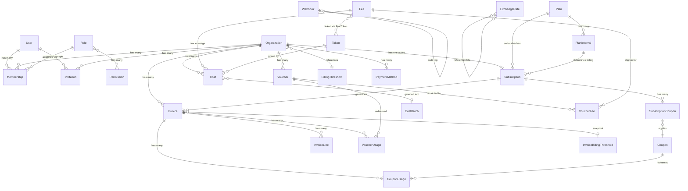

```mermaid
erDiagram
    %% ── IAM ──

    User ||--o{ Membership : "has many"
    User ||--o{ Invitation : "sends / accepts"
    Organization ||--o{ Membership : "has many"
    Organization ||--o{ Invitation : "has many"
    Role ||--o{ Membership : "assigned via"
    Role }o--o{ Permission : "has many"

    %% ── IAM → Billing bridge ──

    Organization ||--o| Subscription : "has one active"
    Organization ||--o{ Invoice : "has many"
    Organization ||--o{ Cost : "has many"
    Organization ||--o{ Voucher : "has many"
    Organization }o--|| BillingThreshold : "references"
    Organization ||--o{ PaymentMethod : "has many"

    %% ── Billing core ──

    Plan ||--o{ PlanInterval : "has many"
    Plan ||--o{ Subscription : "subscribed via"
    PlanInterval ||--o{ Subscription : "determines billing"

    Subscription ||--o{ Invoice : "generates"
    Subscription ||--o{ SubscriptionCoupon : "has many"
    SubscriptionCoupon }o--|| Coupon : "applies"

    Invoice ||--o{ InvoiceLine : "has many"
    Invoice ||--o{ CouponUsage : "has many"
    Invoice ||--o{ VoucherUsage : "has many"
    Invoice }o--o| InvoiceBillingThreshold : "snapshot"

    %% ── Usage-based billing ──

    Fee ||--o{ Cost : "tracks usage"
    Token ||--o{ Cost : "priced by"
    Fee }o--o{ Token : "linked via FeeToken"
    Cost }o--o| CostBatch : "grouped into"

    %% ── Credits & Discounts ──

    Coupon ||--o{ CouponUsage : "redeemed"
    Voucher ||--o{ VoucherUsage : "redeemed"
    Voucher ||--o{ VoucherFee : "restricted to"
    Fee ||--o{ VoucherFee : "eligible for"

    %% ── Standalone ──

    Webhook }o--o| Webhook : "audit log"
    ExchangeRate }o--o| ExchangeRate : "reference data"
```
