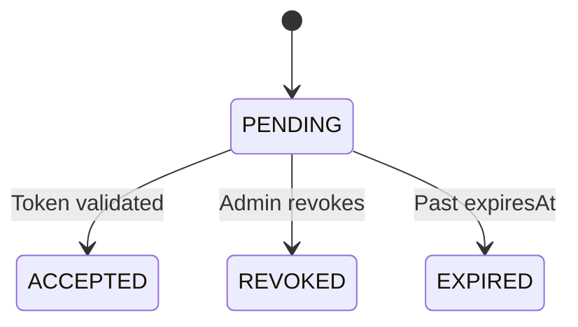

<Info>Proxied from WorkOS — not stored in the application database.</Info>

## Schema

| Field | Type | Description |
|-------|------|-------------|
| `invitationId` | string | Unique identifier (WorkOS format: `inv_*`) |
| `organizationId` | UUIDv7 | FK to Organization |
| `inviterUserId` | string? | Inviter user ID |
| `acceptedUserId` | string? | Acceptor user ID |
| `email` | string | Invited email |
| `token` | string | Invitation token |
| `acceptInvitationUrl` | string | Acceptance URL |
| `roleSlug` | string? | Role on acceptance |
| `state` | enum | `PENDING`, `ACCEPTED`, `REVOKED`, `EXPIRED` |
| `expiresAt` | datetime | Expiration |
| `acceptedAt` | datetime? | Acceptance time |
| `revokedAt` | datetime? | Revocation time |
| `createdAt` | datetime | Creation timestamp |
| `updatedAt` | datetime | Last update |

## Relationships

- **Belongs to** [Organization](/domain/data-modeling/iam/organization)
- **Created by** [User](/domain/data-modeling/iam/user)
- **Accepted by** [User](/domain/data-modeling/iam/user)
- **Creates** [Membership](/domain/data-modeling/iam/membership) on acceptance

## State Transitions

## Business Rules

- Email unique per organization
- Only revoke/resend if PENDING
- Magic link OTP can validate and accept
- Auto-expiry
