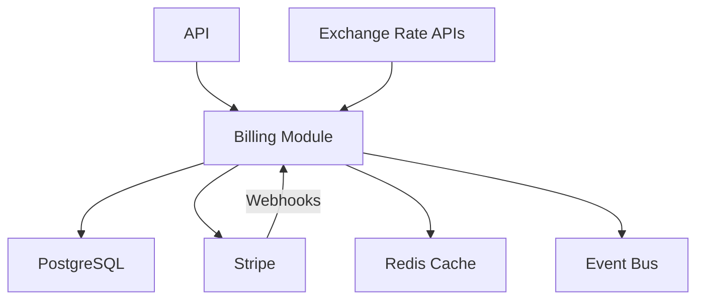

## System Architecture

## Stripe Integration

| Component | Stripe Object | Direction |
|-----------|---------------|-----------|
| Plan | Product | AWSales → Stripe |
| PlanInterval | Price | AWSales → Stripe |
| Fee | Product + Price + Billing Meter | AWSales → Stripe |
| Organization | Customer | AWSales → Stripe |
| Subscription | Subscription | AWSales → Stripe |
| Coupon | Coupon + Promotion Code | AWSales → Stripe |
| Voucher | Credit Grant | AWSales → Stripe |
| Invoice | Invoice | Stripe → AWSales |

## Key Patterns

- **Webhook Processing**: Stripe webhooks update invoices, trigger settlements
- **Exchange Rates**: Dual-provider (PTAX + ExchangeRateAPI) + manual fallback
