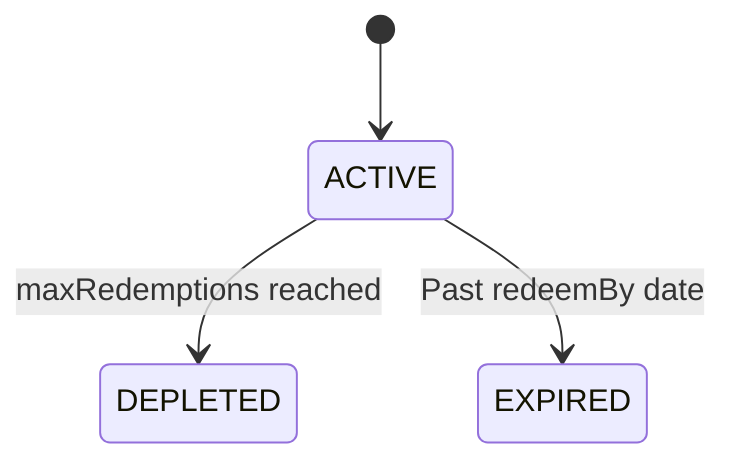

## Types

| Type | Description |
|------|-------------|
| `FIXED` | Absolute discount in cents |
| `PERCENTAGE` | Percentage of invoice total |

## Duration

| Duration | Behavior |
|----------|----------|
| `ONCE` | Applies to one invoice per organization |
| `REPEATING` | Applies for `durationInMonths` billing cycles |

## Lifecycle

## Stripe Sync

Each coupon syncs as a Stripe Coupon + Promotion Code. Applied via SubscriptionCoupon.
