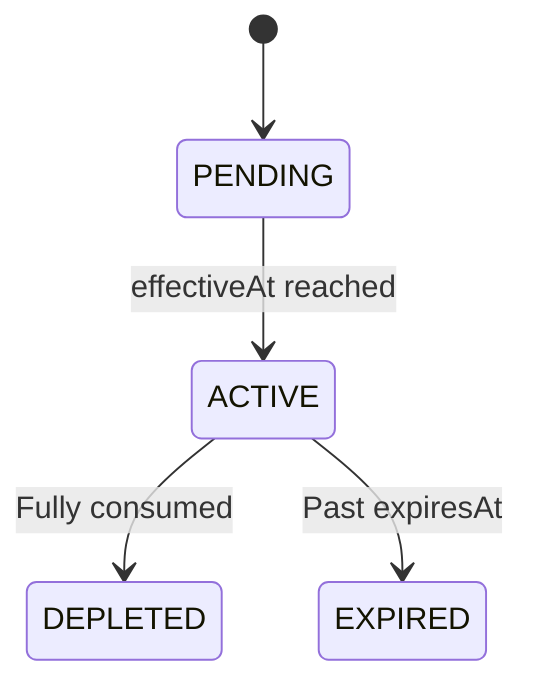

## Overview

Vouchers are billing credits granted to organizations. They work like prepaid credit that's automatically applied to invoices.

## Lifecycle

## Fee Restrictions

Vouchers can optionally be restricted to specific fees via VoucherFees. If restricted, credits only apply to invoices for those fees.

## Stripe Integration

Created as Stripe **Billing Credit Grants**. If the Stripe operation fails, the local record is rolled back.
