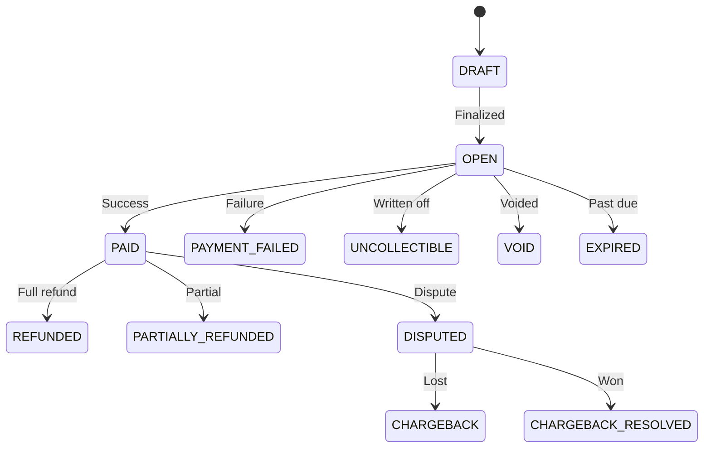

## Invoice Types

| Type | Description |
|------|-------------|
| `PLAN` | Subscription plan charges |
| `FEE` | Usage-based fee charges |

## Status Flow

## Line Items

Each invoice contains line items with name, description, unitPrice, quantity, and amount.

## Amounts

- `totalAmount`: Sum of all line items
- `discountAmount`: Sum of coupon + voucher discounts
- `payableAmount`: totalAmount - discountAmount
