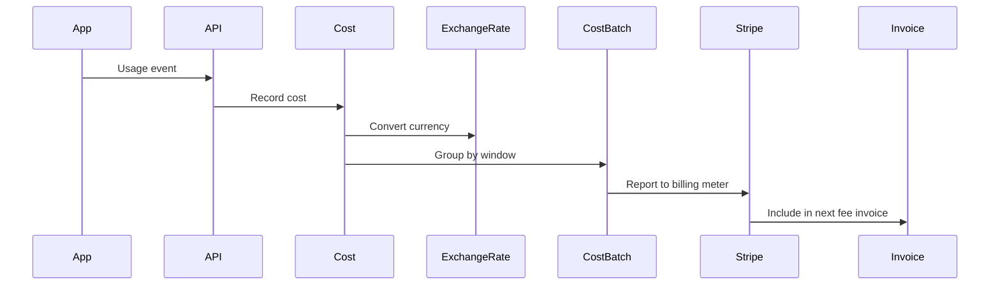

## Flow

## Cost Recording

When a usage event occurs:
1. Verify organization has active subscription
2. Verify token is ACTIVE
3. Verify fee is compatible with org currency
4. Calculate exchange rate (token currency → org currency)
5. Create Cost record with `costBatchWindowRef`

## Cost Batching

Costs are grouped into batches by `costBatchWindowRef` (hash of eventName, orgId, timestamp window). Batches are settled and reported to Stripe billing meters.

## Invoice Generation

Stripe automatically generates fee invoices based on billing meter usage at the end of each billing period.
