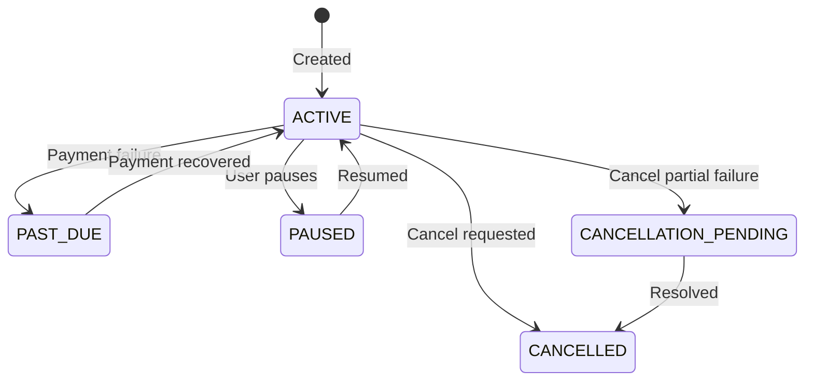

## States

| Status | Description |
|--------|-------------|
| `ACTIVE` | Subscription is active and billing |
| `PAST_DUE` | Payment failed |
| `PAUSED` | Temporarily paused by user |
| `CANCELLATION_PENDING` | Cancel failed partially, pending resolution |
| `CANCELLED` | Fully cancelled |

## State Machine

## Past Due Reasons

| Reason | Description |
|--------|-------------|
| `PLAN` | Plan invoice payment failed |
| `FEE` | Usage fee invoice payment failed |
| `PLAN_FEE` | Both plan and fee payments failed |
