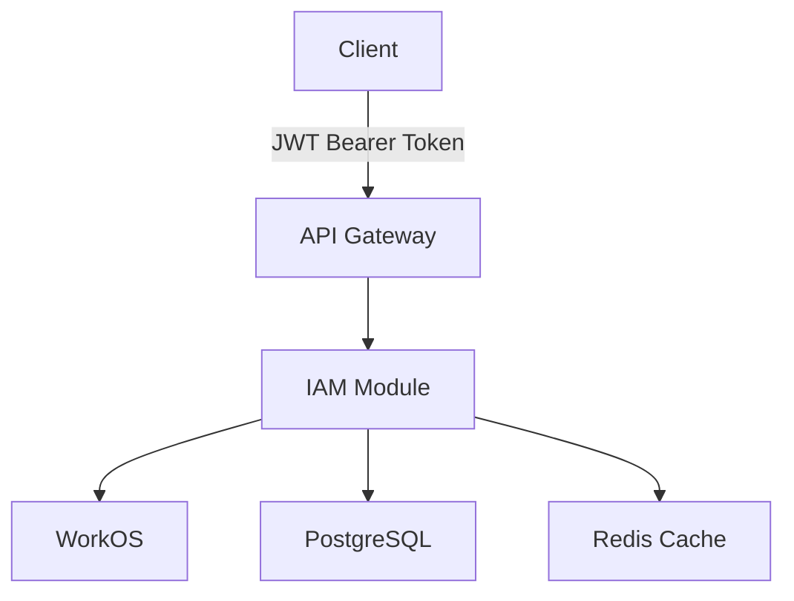

## System Components

## Design Decisions

### JWT Authentication
JWT access tokens contain user identity and organization context, validated statelessly on every request via signature verification.

### Cache Strategy
Users, organizations, and roles cached in Redis by ID. Invalidated on writes.
