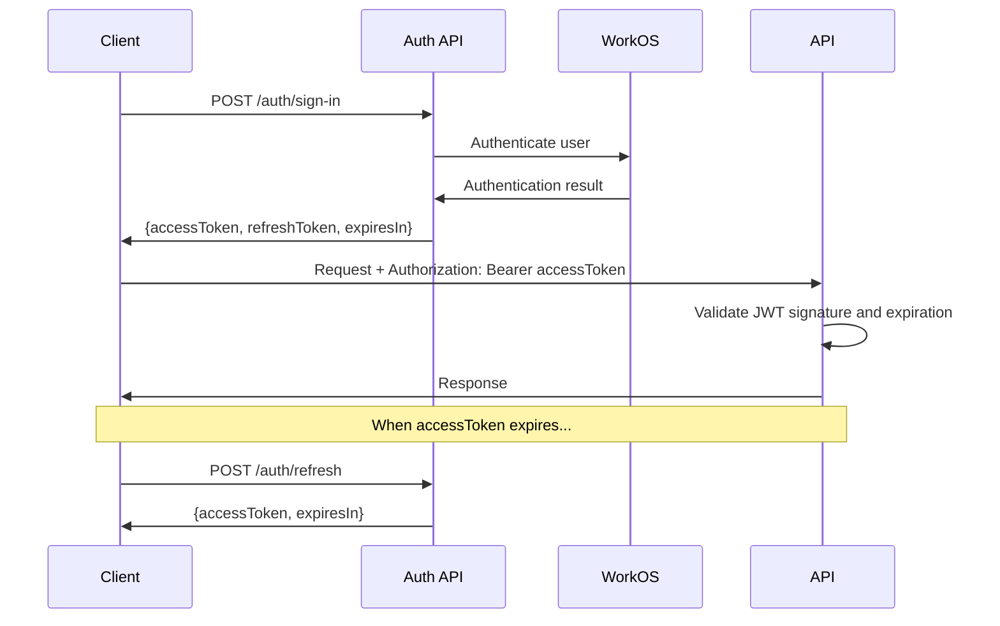

## Token Structure

AWSales issues standard JWT tokens with the following structure:

### Access Token

The access token is a signed JWT containing:
- **sub**: User ID
- **org**: Active organization ID (if activated)
- **exp**: Expiration timestamp
- **iat**: Issued at timestamp

### Refresh Token

An opaque token used exclusively to obtain new access tokens. Stored server-side for revocation support.

## Token Flow

## Organization Switching

When a user activates a different organization, a new `accessToken` is issued with the updated organization context. The `refreshToken` remains the same.

## Security Properties

- **Signed**: Tokens are cryptographically signed (RS256) and cannot be tampered with
- **Short-lived**: Access tokens expire quickly, limiting exposure window
- **Revocable**: Refresh tokens can be revoked on sign-out
- **Stateless validation**: Access tokens are validated without database lookups
