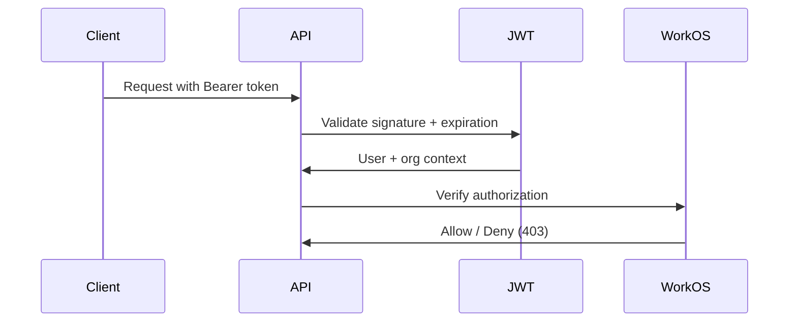

## Model

1. **Roles** define what a user can do
2. **Memberships** assign roles to users within organizations

## Role Types

| Type | Scope | Mutability |
|------|-------|------------|
| `ENVIRONMENT_ROLE` | Platform-wide | Immutable at org level |
| `ORGANIZATION_ROLE` | Per-organization | Fully mutable |

## Access Check Flow

