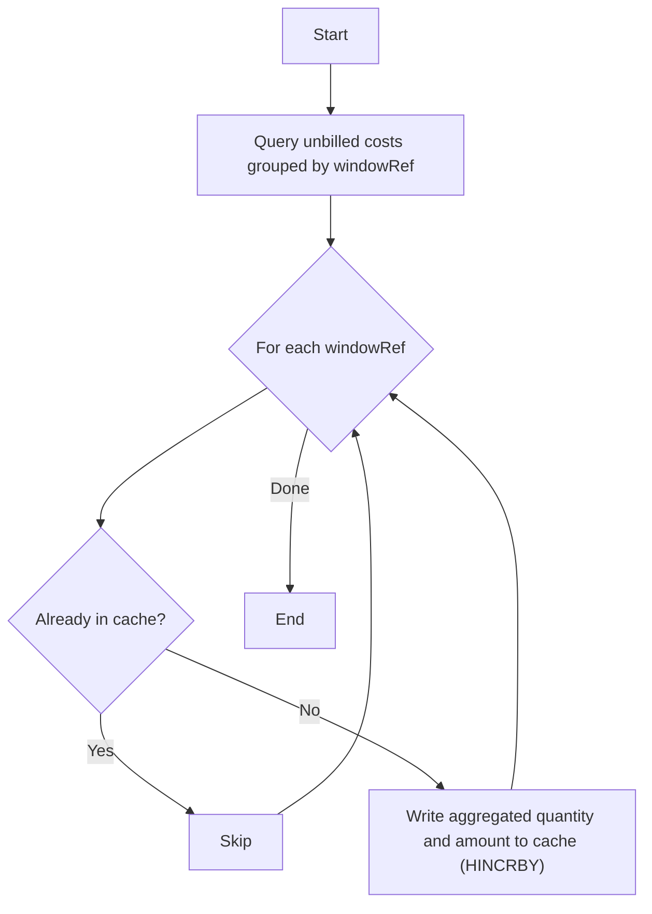

## Purpose

The dispatcher scans for unbilled cost records, groups them by `costBatchWindowRef`, and pushes aggregated totals into a cache layer so the [Processor](/schedulers/cost-settlement-processor) can settle them.

## Flow

<Steps>
  <Step title="Query unbilled costs">
    Fetch cost records not yet assigned to a `CostBatch`, grouped by their `costBatchWindowRef`. The query respects a configurable limit (`COST_SETTLEMENT_DISPATCHER_LIMIT`).
  </Step>
  <Step title="Filter already-dispatched windows">
    For each `windowRef`, check the cache. If the key already exists, the window was already dispatched and is skipped.
  </Step>
  <Step title="Push aggregated totals to cache">
    For each new `windowRef`, atomically increment `quantity` and `amount` in a Redis hash via `HINCRBY`. This makes the data available for the Processor.
  </Step>
</Steps>

## Recommended Schedule

Every 15 minutes.
