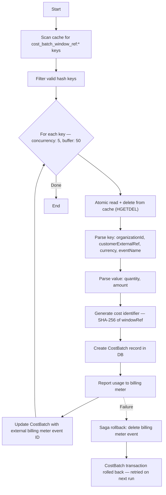

## Purpose

The processor reads dispatched cost windows from the cache, creates a `CostBatch` record, reports the aggregated usage to the billing meter, and links the external reference back to the batch. This is the final step in the usage-based billing pipeline.

## Flow

<Steps>
  <Step title="Scan cache keys">
    List all keys matching `cost_batch_window_ref:*` and filter to those ending with a valid UUID (ignoring control keys).
  </Step>
  <Step title="Read and delete from cache">
    For each key, atomically read the hash (`quantity`, `amount`) and delete it along with its control key via `HGETDEL`. This prevents duplicate processing.
  </Step>
  <Step title="Parse window reference">
    The cache key encodes `organizationId`, `customerExternalRef`, `customerCurrency`, and `eventName`. The hash value provides the aggregated `quantity` and `amount`.
  </Step>
  <Step title="Create CostBatch">
    Within a transaction, create a `CostBatch` record with a deterministic identifier (SHA-256 hash of the `windowRef`).
  </Step>
  <Step title="Report to billing meter">
    Send the aggregated usage to the billing meter, passing the customer reference, event name, identifier, and amount.
  </Step>
  <Step title="Link external reference">
    Save the billing meter event ID back to `CostBatch.externalRef`, marking the batch as settled.
  </Step>
</Steps>

## Error Handling

Settlement runs inside a Saga. If the billing meter call succeeds but a subsequent step fails, the Saga compensates by deleting the billing meter event. Unsettled batches remain in cache and are retried on the next run.

## Recommended Schedule

Every 15–30 minutes, after the dispatcher.
