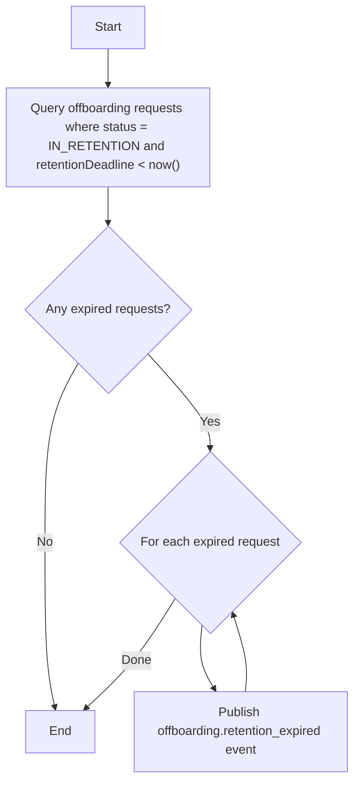

## Purpose

Scans for offboarding requests still `IN_RETENTION` whose `retentionDeadline` has passed, and publishes an `offboarding.retention_expired` event for each one so downstream consumers can finalize the cancellation.

## Flow

<Steps>
  <Step title="Query expired requests">
    Fetch all offboarding requests where `status = IN_RETENTION` and `retentionDeadline` is in the past.
  </Step>
  <Step title="Publish expiration events">
    For each expired request, publish an `offboarding.retention_expired` event containing the full offboarding request resource.
  </Step>
</Steps>

## Recommended Schedule

Once per day.
